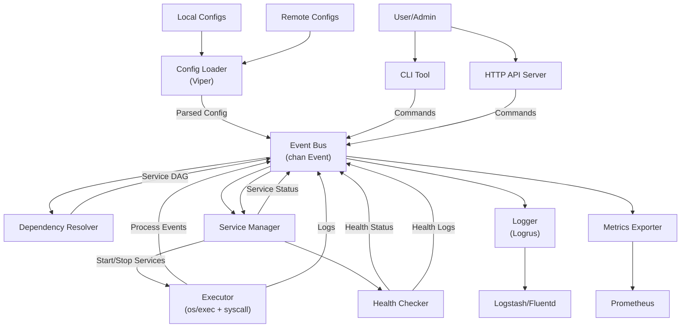

# 0. Goal

- Create a simple yet powerful and fast init system for containers in Golang
- Replace supervisor in monolithic containers
- Must be more straightforward to run and manage services and internal support for modern observability solutions

## 1. Project Setup

- Define project structure (cmd/, pkg/, internal/)
- Logging library: `logrus`
- Configuration library: `viper`

## 2. Service Configuration Management

- Support multiple configuration sources:
  - Local files
  - Remote sources (Json or Yaml url)
  - Each config file should be able to include more than one config file from any of the supported sources
- Define service metadata:
  - Name, description
  - Command and arguments
  - Process count
  - Working directory
  - User and group permissions
  - Dependents and dependencies
  - Service type (one-shot, ongoing, on-demand, per-demand(mutli-shot))

## 3. Service Execution Engine

- Implement process management using `os/exec` and `syscall`.
- Handle:
  - Start, stop, restart, status operations
  - Signal handling (SIGTERM, SIGKILL, etc.)
  - Auto-restart for crashed services
    - Restart delay increase + max restart delay
    - Dependency/t kill
  - Start delay
  - Notify (dependents) delay
- Support running services as background processes with logging and output redirection.

## 4. Service Dependencies

- Implement dependency tree resolution before service execution.
- Define dependencies in the config (e.g., `requires`, `after`, `before`).
- Implement parallel startup for independent services.

## 5. Health Checks

- Support multiple health check types:
  - Process alive check
  - TCP/HTTP endpoint checks
  - Custom command execution as health check
- Implement failure recovery strategies (restart, [notify](https://github.com/nikoksr/notify) admin, etc.).

## 6. Prometheus Metrics Exporter

- Integrate with `prometheus/client_golang`.
- Expose metrics like:
  - Service uptime
  - Restart count
  - Running/failed service count
  - Execution time per service

## 7. CLI & API

- Implement a CLI tool (`onecli`):
  - `start`, `stop`, `restart`, `status`, `reload?`
  - `list` (show all running services, maybe as a tree)
- Implement an HTTP API for remote management:
  - Start/stop services
  - Fetch service status
  - Query logs and metrics

## 8. Logging & Monitoring

- Structured logging (JSON format, integration with Logstash/Fluentd).
- Support log persistence and rotation?

## 9. Service Types

- **One-shot**: Runs once and exits.
- **Ongoing**: Persistent background processes.
- **On-demand**: Starts only when triggered (e.g., via API, socket activation when a dependent service is ready to be online).

## 10. Security & Hardening

- Support running services under restricted users.
- Secure remote API (auth, TLS, RBAC).

## 11. Testing & Benchmarking

- Unit and integration tests (Go’s `testing` package + `TestContainers` for dependencies).
- Stress test service handling.
- Benchmark startup times and memory usage.

## Additional Considerations

- **Resource limits** (CPU, memory restrictions per service)

